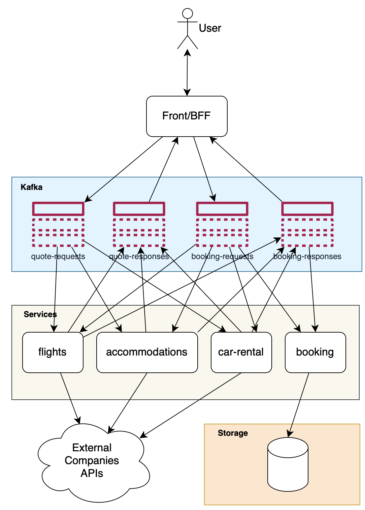

# Best Travel

## Description

This project is a demo of a travel agency application. It is composed of some microservices:

- besttravel-front-bff: the front-end of the application and the BFF (Backend For Frontend) for the other microservices.
  It's not the focus of this project, but it's useful to have a global view of the application. It's a Quarkus
  application with a Vaadin UI. All events are sent to and received from Kafka.

- besttravel-(flights|accommodations|car-rental)-service: these are the microservices that manage the flights,
  accommodations and car rentals requests. They are Quarkus applications that process events from Kafka, send these
  requests to the corresponding external services, process the responses and send the results to Kafka.

- besttravel-booking-service: this is the microservice that manages the bookings. It is a Quarkus application that
  process events from Kafka, store booking information in a "database" (in memory) and make this information available
  to the other microservices (not implemented).

- external-company: this is a mock service that represents all external companies that provide flights, accommodations
  and car rentals services. It just responds with random prices and CONFIRMED status to all requests.

## Architecture



## Technologies

- Java 21
- Quarkus
- Kafka
- Vaadin
- Docker

## Running the application in dev mode

You can run this application in dev mode that enables live coding using (run each command in a separate terminal):

```shell script
docker-compose up -d
cd besttravel-front-bff && ./mvnw compile quarkus:dev
cd besttravel-flights-service && ./mvnw compile quarkus:dev
cd besttravel-accommodations-service && ./mvnw compile quarkus:dev
cd besttravel-car-rental-service && ./mvnw compile quarkus:dev
cd besttravel-booking-service && ./mvnw compile quarkus:dev
cd external-company && ./mvnw compile quarkus:dev
```

Open http://localhost:8080 to see the application.

You can see all activities in the logs of each application. This project provides tracking by open telemetry. You can
see the traces in the Jaeger UI: http://localhost:16686

## Running with `docker-compose`

Alternativelly, you can run all applications of this project with a single `docker-compose` execution:

```shell script
docker-compose -f docker-compose-full.yml up
```

This will build all modules/applications of this project and its dependencies.

Open http://localhost:8080 to see the application.

You can see all activities in the logs of each application. This project provides tracking by open telemetry. You can
see the traces in the Jaeger UI: http://localhost:16686

## Next steps

- Implement the booking service with a real database.
- Implement Unit and Integration tests.
- Implement error handling with retries and dead letter queue.
- Implement a circuit breaker.
- Implement centralized logging.
- Implement a docker-compose with all microservices and Kafka.
- Implement a protocol schema for Kafka messages.
